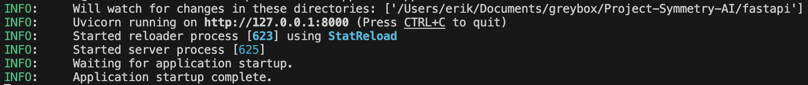

# BACKEND GUIDE

## I. **RUNNING APP**

Refer to [INSTALLATION.md](../INSTALLATION.md) for more in depth configuration details
and dependency installation. This section is purely for running the backend.

1) Ensure that your current working directory is `fastapi` (i.e. run `cd fastapi`)
2) If you have not already, set up your virtual environment (`python3 -m venv venv`)
3) Switch to the virtual environment (`source venv/bin/activate` or `venv\bin\activate.bat` depending on OS)
4) If you have not already, install dependencies (`pip install -r requirements.txt`)
5) Finally, run the app with Uvicorn (`uvicorn app.main:app --reload`)
   1) To use another port, use `--port <number>` when executing Uvicorn

This will instantiate the app on your local port hosted utilizing uvicorn.
You should receive a message similar to the following:



To test your results utilizing the configured endpoints, use a tool like POSTMAN
or curl in order to make GET or POST requests and receive formatted JSON responses.

## II. **FILE STRUCTURE**

`app` is the root package of the python project.

`app/ai` contains the backend ML functionality.

`app/api` contains the API endpoints exposed by the web server.

`app/model` contains request and response structures for communication between the front and back end.

## III. **CURRENT FUNCTIONALITY**

### `/symmetry/v1/wiki/articles`

**Protocol:** `GET`

**Parameters:**
 * `query`: A Wikipedia article URL or title
 * `lang`: Optional. A language short code (i.e. "en" or "fr") defaulting to "en" for English.

**Response:**

```json
{
    "sourceArticle": "<article content>",
    "articleLanguages": [
        // Article language data
    ]
}
```

### `/symmetry/v1/articles/compare`

> [!NOTE]
> This endpoint is a work in progress and currently only returns dummy data.

**Protocol:** `POST`

**Parameters:**
```json
{
    "article_text_blob_1": "<article 1 content>",
    "article_text_blob_2": "<article 2 content>",
    "article_text_blob_1_language": "<article 1 short language code>",
    "article_text_blob_2_language": "<article 2 short language code>",
    // Float ranging from 0-1 representing similarity percentage.
    "comparison_threshold": 0.8,
    "model_name": "<model name string>"
}
```

Response:
```json
{
    "comparisons": [
        // Array of comparison objects.
        {
            "left_article_array": [
                // Array of article 1 content divided into subsections.
            ],
            "right_article_array": [
                // Array of article 2 content divided into subsections.
            ],
            "left_article_missing_info_index": [
                // Array of indices of article 1 subsections that are not present in 2.
            ],
            "right_article_extra_info_index": [
                // Array of indices of article 2 subsections that are not present in 1.
            ]
        }
    ]
}
```

## IV. **CONCEPTS & RESEARCH**

### Simple UI
The UI is supposed to be as simple as possible - the UI team is supposed to focus their
efforts on improving the user experience, not covering all possible cases.
That means that the API/middleware is responsible for the bulk of logic related to input
validation.

For example, the dynamic search box allowing queries by URL or article title is handled
by the wiki articles endpoint rather than the UI.

### Semantic Comparison Without Translation
The language comparison model in use does not require that the input texts be in the same language.

### JSON vs XML
We were tasked with investigating the benefits of using XML over JSON for communications
as it might be easier for some ML models to work with.

Our findings were that the primary benefit of using XML for some ML models is that it can
be used to more easily guard against prompt injection.
It is otherwise largely harder to work with, and is a model-specific detail.

### CORS
Cross-origin resource sharing is useful for protecting against certain attacks.
By restricting resources to whitelisted domains, we can prevent this.

However, Symmetry currently operates as a local server. CORS will not be important until
a future state where a standalone Symmetry server exists.

### Endpoint Naming Conventions

A quick read on RESTful resource naming: https://restfulapi.net/resource-naming/

The current format is `/symmetry/v1/<path>/<to>/<resource>`.

For a more dense and in-depth view of the RESTful philosophy, the above article
links Roy Fielding's dissertation:
https://ics.uci.edu/~fielding/pubs/dissertation/rest_arch_style.htm#sec_5_2_1_1

## V. **WHATS NEXT**

### External Request Rejection
As Symmetry does run a local web server, it would be a good idea to ensure that all
remote requests are rejected.

### Porting
Currently, the port number is hard-coded in the UI. The port should be configurable
so that Symmetry can run without conflicts on systems running other servers.

### Caching
Caching article content can significantly increase response time. However, if not done
correctly, it can effectively cause memory leaks.

For a baseline, one can revert 279c847dddf099609d47547c6b1e33254b5892e2. This requires
additional edits - the implementation does not purge stale entries until they specifically
are requested from it again. If the same article is not requested twice, this results in
a continuous increase in memory consumption.

### Live Comparison Data
The [comparison endpoint](#symmetryv1articlescompare) currently returns dummy data.
When the ML team completes their side, this endpoint will need to be connected to
return real data.

