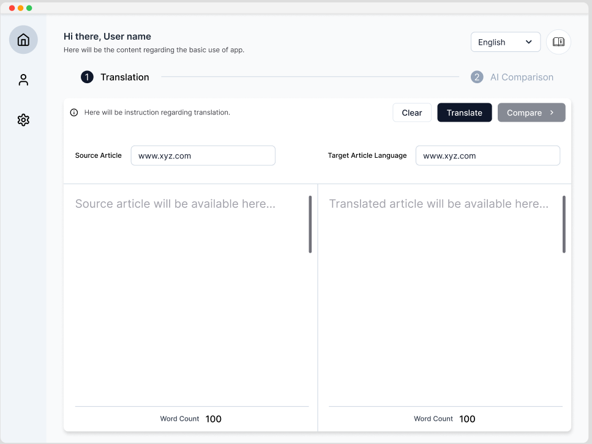
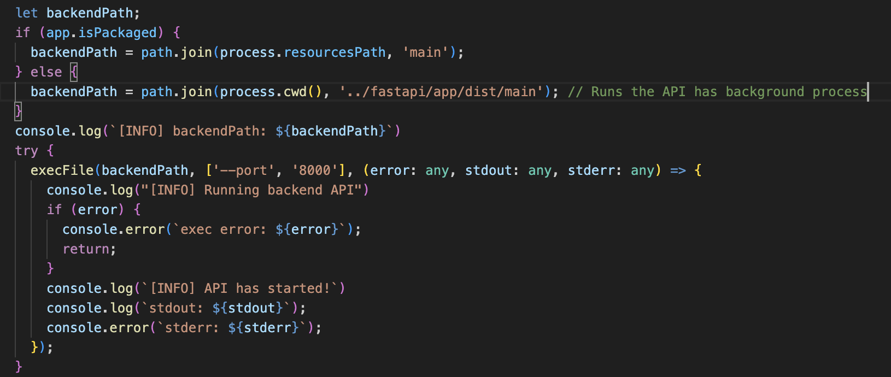
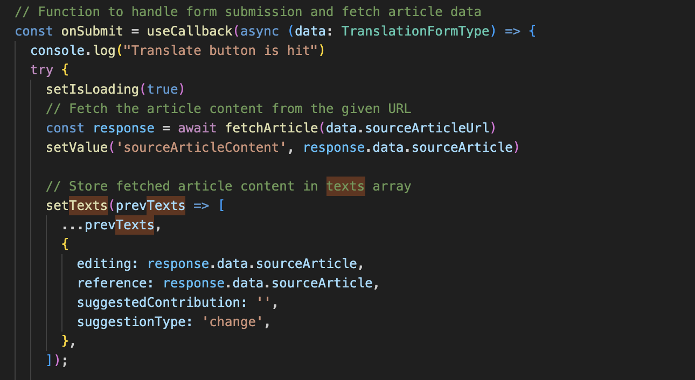
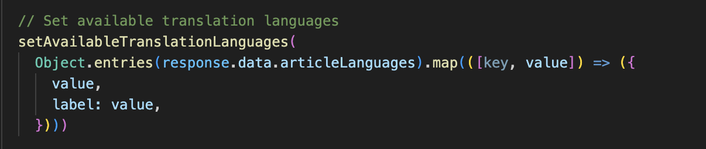
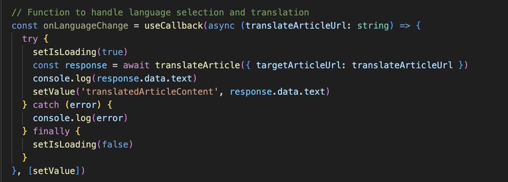
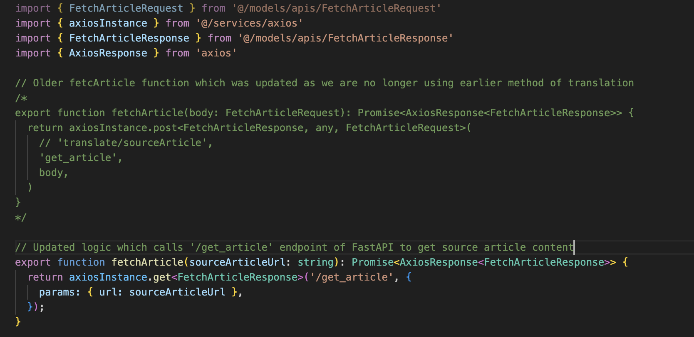
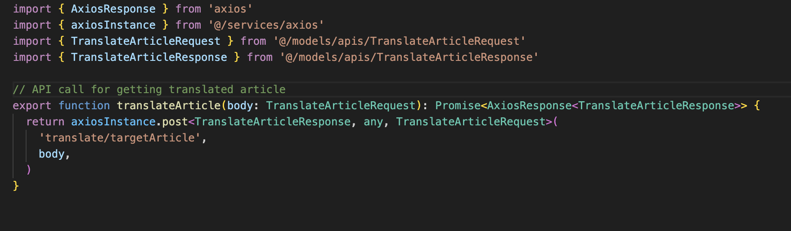
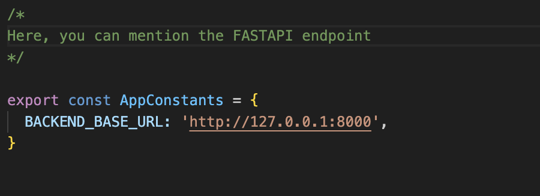

# Project Symmetry AI Guide

This document provides details on the work that has been done so far and the work that needs to be completed in the coming years. The content is organized into multiple sections with the purpose of ensuring that a new joiner does not experience the cold start problem. The goal is to provide sufficient project awareness to assist in the project's development.

> Project Symmetry is an application using AI to accelerate Wikipedia's translation efforts in less-represented languages (less than 1 million articles) by building a semantic understanding of similar articles in various Wikipedia languages and providing relevant translations for missing information

## Quick Links

- **Notion**: [Project-Symmetry-Notion](https://www.notion.so/grey-box/Project-Symmetry-14ee93d91c4742daaa07801c7795663e)
- **GitHub**: [grey-box/Project-Symmetry-AI](https://github.com/grey-box/Project-Symmetry-AI)
- **GitHub (old)**: [grey-box/Project-Symmetry-Semantic-comparison-Alpha](https://github.com/grey-box/Project-Symmetry-Semantic-comparison-Alpha)
- **Installation Guide**: [INSTALLATION.md](../INSTALLATION.md)
- **API Documentation**: [api-documentation.md](../api-documentation.md)
- **Contributing Guidelines**: [CONTRIBUTING.md](../CONTRIBUTING.md)
- **Learn More**: [LEARN.md](../LEARN.md)

## Project Structure

```plain
Project-Symmetry-AI/
├── backend-fastapi/          # FastAPI backend
│   ├── app/
│   │   ├── main.py           # Main application entry point
│   │   ├── ai/               # AI and ML components
│   │   ├── api/              # API endpoints
│   │   ├── model/            # Data models
│   │   └── prompts/          # AI prompts
├── ui/                       # Frontend (Electron + React)
│   ├── src/
│   │   ├── components/       # React components
│   │   ├── services/         # API services
│   │   ├── models/           # TypeScript interfaces
│   │   └── constants/        # Application constants
├── T5-finetuned/             # Fine-tuned T5 model
└── guide/                    # This documentation
```

## Project Objective

The purpose of the Symmetry-AI app is to provide analytical insights into translation services. The core assumption of the project is that, during content translation---particularly through human translators or older translation systems---certain information may be omitted, or additional details may be inadvertently added.

The application's objective is to help users identify critical information that may have been lost during translation, especially in underrepresented languages.

Its usefulness is particularly evident in scenarios where internet access is unavailable, and there is a need for an application that can detect missing information in sensitive and critical content, such as medical documents, government communications (e.g., UN reports), and materials for NGOs.

Currently, the project is focusing mainly on providing semantic understanding of translated content on Wikipedia pages. Later, it might be expanded to other contents on internet.

The final phase of project will be providing translation services on underrepresented languages using AI.

## 🚀 Project Working

The project includes a desktop application with multiple features. The features include rendering Wikipedia article on the frontend using Wikipedia API service.

The article can be rendered by providing either title or corresponding URL in 'Source Article' textbox as shown in red.



Once the user enters either URL or Title (e.g. World War II or *<https://en.wikipedia.org/wiki/World_War_II>*) and hits enter, the content from that website will be rendered on left side Source Article textbox.

Also, the Target Article Language (Orange box) should be a dropdown box (updated in the code) will provide all the languages for which translation is available on Wikipedia page for that page.

> Note: Different Wikipedia pages have different translated content available in different languages. And they are either human translated or Machine translated*

The user will select the language in which user wants to see the translated version of the original content on the left and hit 'Translate' button (yellow box), the translated content should appear on right side textbox.

The next step will be getting comparison between two contents (left textbox and right textbox) to get user know what information got missed during translation to other language (color coded to red in original content) and what information got added extra during translation (color coded to green in translated content). This feature will use Large Language Models (LLMs) to provide the comparison (semantic understanding of the information). We should try to use smaller versions of LLMs, which are faster and more particular to our task. This Small Language Models (SLMs) are trained using [Knowledge Distillation](https://www.geeksforgeeks.org/what-is-llm-distillation/) from LLMs.

There are multiple open-source models available which we can use in building this feature. The most popular one is [Hugging Face](https://huggingface.co/models?sort=trending&search=semantic+).

The final step will be to provide the data analytics on the translated article to capture the usefulness of the translated content which might include details like number of sentences got missed, magnitude of extra information that got added during translation or authenticity of translated content (whether it can be used for making decisions). It is up to the developer's skills and imagination to what different analytics that can be provided which might be useful to user.

## ✅ Work Completed

The application currently has three features active:

1. Rendering the source article using Title or URL
2. Providing translation languages available as dropdown
3. Rendering the translated article

The work on building LLM API for semantic comparison is in working. The base code is ready and will be available in the repository.

## 📋 Work Pending

The following work is pending and needs attention:

1. Getting the LLM API for semantic comparison active and running
2. Providing color coded sentences which are missed in translation (in red) and have got added during translation (in green)
3. Data Analytics on the translated content
4. Providing translation to under-represented languages using AI

The next section will include details on the code, which might be helpful to developer working on both frontend and backend.

## 📦 Repository Details

The repository can be found in this GitHub :[Project-Symmetry-AI](https://github.com/grey-box/Project-Symmetry-AI). 

The older repository can be found in this GitHub : [Project-Symmetry-Semantic-comparison-Alpha](https://github.com/grey-box/Project-Symmetry-Semantic-comparison-Alpha).

There are two sections as with any application viz. Backend and Frontend.

## Backend

The backend is handles by FastAPI. It is built using Python language.

The directory is "[FastAPI Backend](https://github.com/grey-box/Project-Symmetry-AI/tree/main/fastapi)". It has main.py file under app directory which contains all the endpoint and other details. It has endpoints for:

1. Getting Source Article ('get_article')
2. Getting Translated languages list ('get_article')
3. Getting Translated Article (Need to work upon)

When you enter 'npm run start' to run the application, it is run as background process in main.ts file (`GreyBox/Project-Symmetry-AI/ui/src/main.ts`)



## Frontend

The frontend is built using [Neutron](https://www.electronjs.org/) framework. Currently we are running the application using command 'npm run start' but objective should be getting executable file for all OS (Windows, Mac and Linux) where user can double click on App icon and application should start running.

The frontend code has multiple important files which makes it work. Here are the main files mentioned below:

1. TranslationSection.tsx (`GreyBox/Project-Symmetry-AI/ui/src/components/`)

This file handles all the rendering that happens on frontend, whether it is rendering source article, providing dropdown for translated languages list and rendering translated article.

This is file where we call the FastAPI endpoint to get content from Wikipedia article to get both article and available languages.





The logic of rendering translated languages is still pending and needs to be worked upon. The endpoint for translated article needs to be developed in FastAPI's main.py file.



## API Structure Call from Frontend

The API call is structured using [axios](https://axios-http.com/docs/intro). The main function which is fetchArticle.ts (`GreyBox/Project-Symmetry-AI/ui/src/services/`). It provides source article and available languages.



It defines the endpoint it will call from fastapi ('get_article') as well as it takes input as 'sourceArticleURL' which user enters on frontend.

The input structure to the API is define in `'@/models/apis/FetchArticleRequest'` and output from the endpoint is defined in `'@/models/apis/FetchArticleResponse'`.

The structure of API call for getting translated article in defined in 'translateArticle.ts' (`GreyBox/Project-Symmetry-AI/ui/src/services/`)



It has very similar form as fetchArticle but the endpoint is 'translate/targetArticle' which it will call to backend API. So, ensure when you build endpoint for getting translated article in FastAPI, provide this as endpoint to that function.

The URL to which the frontend will call, which include host and port is defined in 'AppConstants.ts' (`GreyBox/Project-Symmetry-AI/ui/src/constants/`)



## Key Files and Components

### Backend Files

- **Main Application**: [`backend-fastapi/app/main.py`](../backend-fastapi/app/main.py)
- **Semantic Comparison**: [`backend-fastapi/app/ai/semantic_comparison.py`](../backend-fastapi/app/ai/semantic_comparison.py)
- **LLM Comparison**: [`backend-fastapi/app/ai/llm_comparison.py`](../backend-fastapi/app/ai/llm_comparison.py)
- **Translation Service**: [`backend-fastapi/app/ai/translations.py`](../backend-fastapi/app/ai/translations.py)
- **Wiki Article API**: [`backend-fastapi/app/api/wiki_article.py`](../backend-fastapi/app/api/wiki_article.py)
- **Comparison API**: [`backend-fastapi/app/api/comparison.py`](../backend-fastapi/app/api/comparison.py)

### Frontend Files

- **Main Application**: [`ui/src/main.ts`](../ui/src/main.ts)
- **Translation Section**: [`ui/src/components/TranslationSection.tsx`](../ui/src/components/TranslationSection.tsx)
- **Comparison Section**: [`ui/src/components/ComparisonSection.tsx`](../ui/src/components/ComparisonSection.tsx)
- **Fetch Article Service**: [`ui/src/services/fetchArticle.ts`](../ui/src/services/fetchArticle.ts)
- **Translate Article Service**: [`ui/src/services/translateArticle.ts`](../ui/src/services/translateArticle.ts)
- **App Constants**: [`ui/src/constants/AppConstants.ts`](../ui/src/constants/AppConstants.ts)

## Getting Started

1. Follow the installation guide: [INSTALLATION.md](../INSTALLATION.md)
2. Review the API documentation: [api-documentation.md](../api-documentation.md)
3. Check the contributing guidelines: [CONTRIBUTING.md](../CONTRIBUTING.md)

## Additional Resources

- **Project README**: [README.md](../README.md)
- **Learn More**: [LEARN.md](../LEARN.md)

Finally, best wishes to whomever going to work on this code. It may take some time to understand the working of the code. Try to install it using documentation provided in 'INSTALLATION.md' and then follow the explanation provided in this document. BEST OF LUCK! - Suraj Patil
